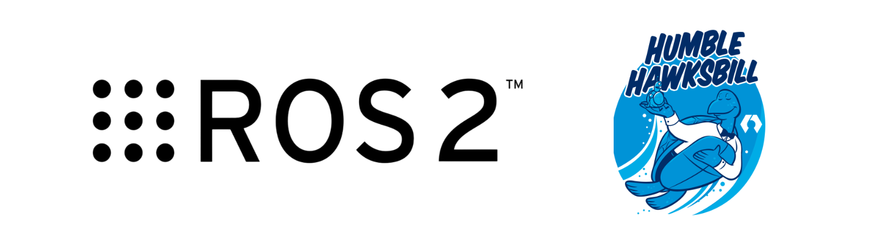
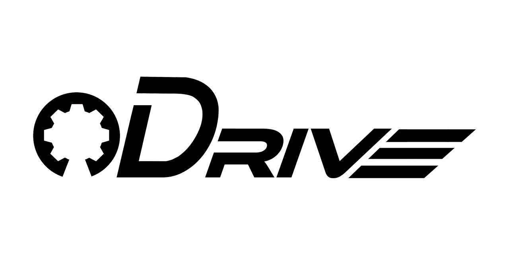
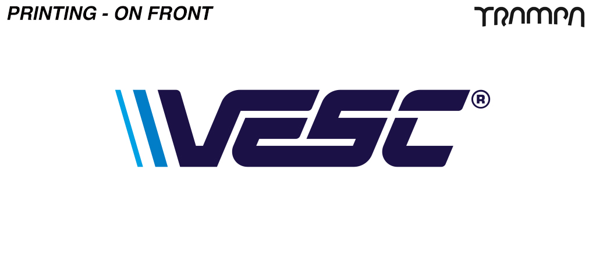
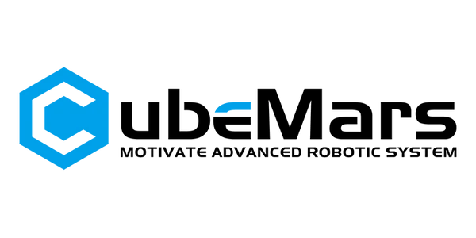
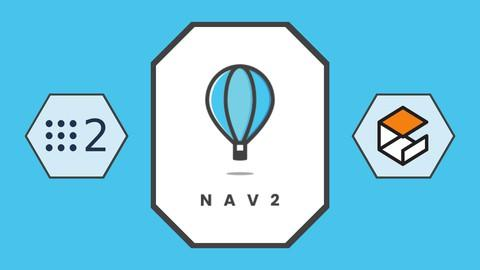

<html lang="en">
<head>
    <meta charset="UTF-8">
    <meta name="viewport" content="width=device-width, initial-scale=1.0">
    <title>Avnish Deshmukh - Robotics Enthusiast</title>
    <link rel="icon" sizes="32x32" href="favicon-32x32.png" type="image/png">
    <link rel="icon" sizes="16x16" href="favicon-16x16.png" type="image/png">
    
</head>
<body>

<!-- Profile Section -->

    
    

        <h2 style="color: #0078D4;">Hi! I am Avnish Deshmukh.</h2>
        <h2 style="color: #0078D4; margin: 5px 0;">Robotics Enthusiast & Tech Innovator</h2>
        

            A 🤖 robotics enthusiast, tech team member at MTT ROBOCON, and a dedicated learner passionate about 🔧 electronics, 💻 coding, and 🛠️ mechanical design. 
            I love solving complex problems and pushing the boundaries of technology. Living with ⚡ epilepsy has taught me resilience and has been an integral 
            part of my journey, shaping who I am today. Welcome to my personal website, where I share my projects, experiences, and insights from the world of 
            robotics and beyond! 🚀
        

    

    

        

            

		    
		    
		    
		    
		    
		    
		    
		    
		    
		    
		    
		    
		    
		    
		    
		    
		    
		    
		    
		    
		    
		    
		    
            

		    

		    
		    
		    
		    
		    
		    
		    
		    
		    
		    
		    
		    
		    
		    
		    
		    
		    
		    
		    
		    
		    
		    
		    
            

        

    

    <!-- Journey Timeline -->
    

        <h2 style="text-align: center; color: #0078D4;">My Journey</h2>
    
        <!-- Timeline Events -->
        

            

                <h3>Born</h3>
                
2005

            

        

    
        

            

                <h3>Completed 10th Grade</h3>
                
Stella Maris School

            

        

    
        

            

                <h3>Started Diploma & Joined MIT Tech Team</h3>
                
Participated in DD Robocon Air 4 MIT World Peace University

            

        

    
        

            

                <h3>Participated in DD Robocon Air 2</h3>
                
2023

            

        

    
        

            

                <h3>Started with ROS2</h3>
                
Participated in DD Robocon Air 3 2024

            

        

    
        

            

                <h3>Aiming for DD Robocon Air 1</h3>
                
2025

            

        

    

    
    

    <!-- Social Links Section -->
    

        <!-- LinkedIn Profile Box -->
        

            
            <h3>Avnish Deshmukh</h3>
            
Robotics Enthusiast & Tech Innovator | Electronics | ROS2 | Project Management

            <a href="https://www.linkedin.com/in/avnish-deshmukh" class="profile-link" style="background-color: #0A66C2;">View LinkedIn</a>
        

        <!-- GitHub Profile Box -->
        

            
            <h3>Avnish Deshmukh</h3>
            
Robotics Enthusiast & Tech Innovator | Exploring code and hardware

            <a href="https://github.com/avnishd2105" class="profile-link" style="background-color: #181717;">View GitHub</a>
        

        <!-- Instagram Profile Box -->
        

            
            <h3>Avnish Deshmukh</h3>
            
Follow me for behind-the-scenes of my tech and robotic endeavors!

            <a href="https://www.instagram.com/avnishdeshmukh" class="profile-link" style="background-color: #E4405F;">View Instagram</a>
        

    

    <!-- Contact Button -->
    

            <!-- Added space -->
        <a href="mailto:avnishdeshmukh2105@gmail.com" class="contact-button">Contact Me</a>
    

    <!-- Back-to-Top Button -->
    <button id="backToTopBtn" onclick="scrollToTop()">Back to Top</button>

    

</body>
</html>
